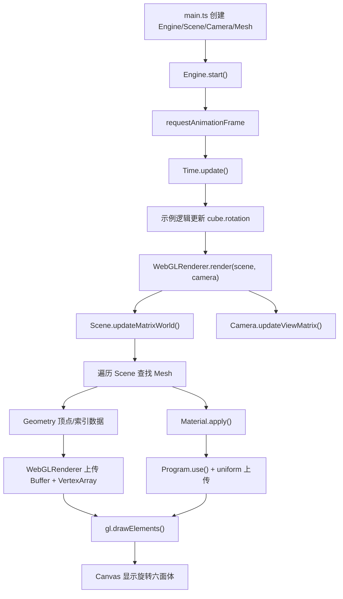
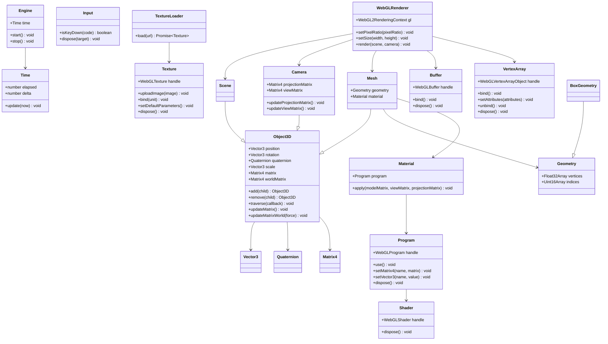

# MiniEngine 架构说明

这个项目实现了一个最小 WebGL2 渲染引擎，用 TypeScript 拆分为 Core、Renderer、Scene、Geometry、Math 和 Asset 六层。当前示例会在全屏 canvas 中显示一个持续旋转的六面体。

## 数据流图

## 类图

## 渲染链路

1. `Engine` 驱动主循环，每帧更新 `Time`。
2. 示例逻辑根据 `time.delta` 更新 `cube.rotation`。
3. `WebGLRenderer.render()` 更新场景和相机矩阵。
4. `WebGLRenderer` 遍历 `Scene`，找到所有 `Mesh`。
5. `Geometry` 的顶点和索引数据被上传到 GPU，并缓存为 `Buffer` 和 `VertexArray`。
6. `Material` 启用 `Program`，上传模型、视图、投影矩阵和颜色。
7. `gl.drawElements()` 输出最终画面。

## 目录职责

- `Core`：主循环、时间和输入。
- `Renderer`：WebGL2 API 封装、GPU 资源和材质。
- `Scene`：场景树、对象变换、相机和 Mesh。
- `Geometry`：CPU 侧几何数据。
- `Math`：向量、矩阵和四元数。
- `Asset`：资源加载入口，目前包含纹理加载器。
