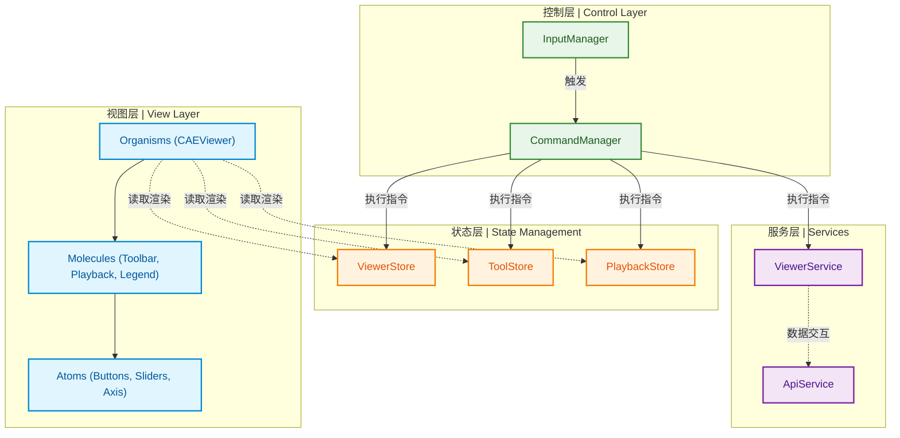

# IntevueCAEWeb 前端架构概览

> [!TIP]
> **设计初衷**：为大型 3D 仿真可视化（CAE）客户端打造**高内聚、低耦合**的现代化企业级单页应用架构，保障系统的高扩展性与可维护性。

---

## 架构分层设计

---

## 核心架构

| 模式 / 思想 | 具体实现 | 解决的核心业务痛点 |
| :--- | :--- | :--- |
| **原子化设计 (Atomic Design)** | `components/{atoms, molecules, organisms}` | 界面复杂度极高时，保证组件的绝对复用性，防止“面条代码”。 |
| **命令模式 (Command Pattern)** | `command/CommandManager.js` | 实现了业务操作与 UI 的完全解耦，原生支持无限步长的**撤销(Undo)/重做(Redo)**功能。 |
| **统一输入总线 (Input Bus)** | `input/InputManager.js` | 将复杂的 3D 画布鼠标、键盘交互统一拦截和分发，避免了 Vue 组件中繁杂的原生事件监听。 |
| **响应式状态树 (Stores)** | `stores/*Store.js` | 所有的 UI 组件都基于状态驱动（Data-Driven），通过统一修改 Store 来触发界面的全量更新。 |

> [!NOTE]
> **致后续开发者：**
> 如果您需要新增一个画布工具（如：距离测量），请不要直接修改核心 Viewer 代码。您只需：
> 1. 在 `stores` 中定义工具状态。
> 2. 在 `command` 中编写具体的执行逻辑（实现基类的 execute 方法）。
> 3. 在 `molecules/Toolbar` 挂载您的工具入口即可。
