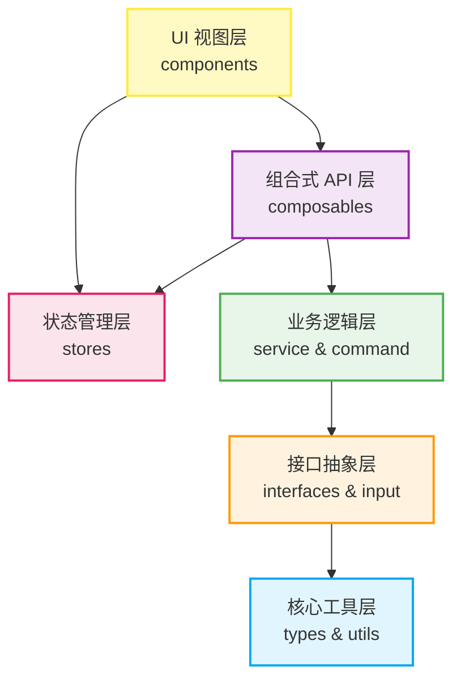

# IntevueCAEWeb 前端架构与代码全景解析

为了应对后续引入 3D WebGL 渲染引擎带来的极高复杂度，本项目采用 **Clean Architecture（整洁架构）** 和 **Atomic Design（原子化设计）** 两种核心思想。

以下是针对项目中核心架构层级与代码流转的详细梳理：

## 一、 层级依赖架构图

各模块被严格划分了责任边界。**数据流和依赖关系是单向向下的**，这保证了底层业务逻辑完全独立于 UI 视图，方便后续接入 `Three.js` 或 `VTK.js` 进行平滑过渡。

---

## 二、 核心目录树与详细职责划分

> [!TIP]
> 此结构遵循了“高内聚、低耦合”的代码编写原则。UI 组件负责“长什么样”，而不用管“怎么做”。

### 1. 基础设施层 (Infrastructure)
*   `utils/`：**纯函数工具库**。包括 `format.js`（数据格式化）、`validators.js`（校验器）等。零外部依赖。
*   `types/`：**核心类型与基类**。
    *   `constants.js`：定义全局枚举（如 `TOOL_TYPE`）。
    *   `EventEmitter.js`：实现观察者模式，用于跨层解耦通信。
    *   `BaseTool.js` / `ToolRegistry.js`：工具插件系统的基类，使得后续新增工具无需修改主流程代码。

### 2. 抽象定义层 (Abstractions)
*   `interfaces/`：**引擎隔离接口**。包括 `IViewer.js`, `IPlayback.js`, `ILegend.js`。
    *   > [!IMPORTANT]
        > 这些是极其关键的设计。业务逻辑只会调用 `IViewer` 中定义的标准方法，而具体的 3D 渲染器（如 Three.js）去**实现**这些接口。

### 3. 系统交互层 (Interactions)
*   `input/`：**外设输入拦截器**。
    *   将浏览器的原生 `鼠标 (Mouse)` 和 `键盘 (Keyboard)` 事件进行标准化拦截，转化为纯粹的 CAE 业务指令（如：旋转视角、拾取节点）。
*   `command/`：**命令模式实现**。
    *   包含 `CommandManager.js` 和 `CommandBase.js`。工程软件必备架构，负责将用户的每一次操作封装为独立命令，这是后续实现**多步撤销 (Undo) / 重做 (Redo)** 功能的基石。

### 4. 业务应用层 (Application)
*   `service/`：**业务中枢**。
    *   `ApiService.js`：处理与后端的网络请求（拉取网格数据、云图结果）。
    *   `ViewerService.js`：串联渲染接口、输入和命令体系的总引擎。
*   `stores/`：**全局响应式状态 (Pinia)**。
    *   严格拆分为细粒度模块：`viewerStore.js` (渲染状态), `toolStore.js` (工具激活状态), `playbackStore.js` (动画控制), `legendStore.js` (云图图例)。
*   `composables/`：**Vue Hooks 胶水层**。
    *   如 `useViewer.js`。它们负责把底层的面向对象逻辑（Service/Command）包装为 Vue 响应式的 API，供前端页面安全调用。

### 5. 视图渲染层 (Presentation)
*   `components/`：**原子化 UI 目录**。根据复用粒度拆分：
    *   `atoms/` (原子)：最基础的颗粒，如 `BaseButton.vue`、经过纯手工等距投影重构的 `AxisIndicator.vue`（坐标轴）。
    *   `molecules/` (分子)：由原子组合而成的功能区，如经过外挂 SVG 分离重构的 `Toolbar.vue`（工具栏）、`LegendPanel.vue`（图例面板）。
    *   `organisms/` (组织)：构成完整页面的大区块，如容纳 3D 视窗的 `CAEViewer.vue`。
*   `assets/icons/`：**静态物理资产**。
    *   存放独立剥离的 `.svg` 物理文件，结合 Vite 的 `?raw` 原生字符串导入，保证了业务层 Vue 文件的极致整洁与渲染性能。

---

## 三、 标准交互控制流 (Control Flow Example)

为了说明这套架构是如何紧密运转的，我们以**“用户点击工具栏的切面 (Slice) 按钮”**为例，梳理其代码流转全过程：

1.  **用户操作 (UI)**：在 `components/molecules/Toolbar.vue` 中点击了切面按钮。
2.  **状态变更 (Store)**：触发了 `@click` 事件，调用 `toolStore.setCurrentTool('SLICE')`。
3.  **胶水层感应 (Composable)**：`useViewer.js` 钩子监听到全局当前激活的工具发生了变化。
4.  **下发命令 (Command)**：组合式函数将切面操作封装为独立命令对象，推送到 `CommandManager.js` 执行队列。
5.  **业务处理 (Service)**：命令管理器调用 `ViewerService`，发出请求开启 3D 切面模式。
6.  **调用接口 (Interface)**：Service 最终只调用 `IViewer.enableSlicePlane()` 方法。至此业务流程结束，交由底层实际挂载的 3D 引擎通过操控 WebGL 着色器完成剖面的真实切割动作。

---

## 四、后续改进

1.  commond可能需要通过后端实现，不需要维护两个commondmanager
2.  input的模板化 json格式